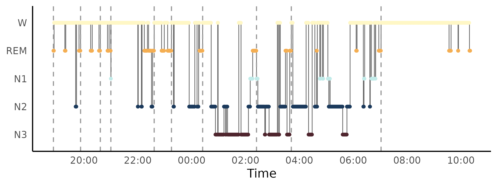
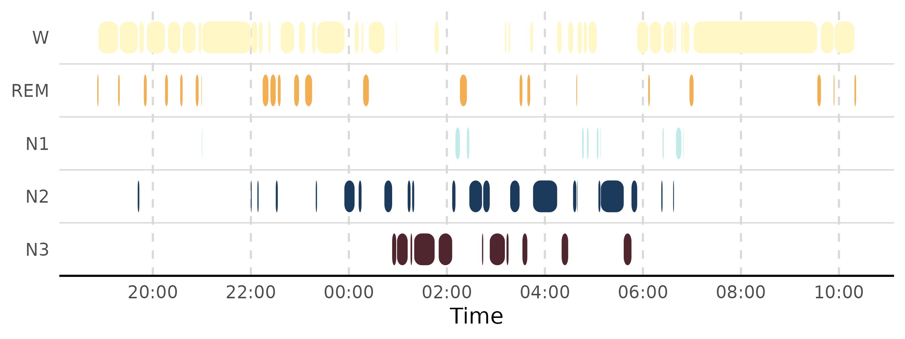
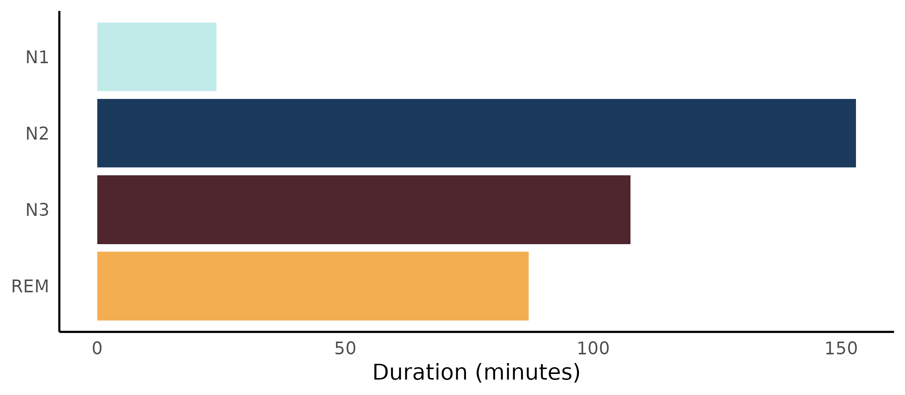
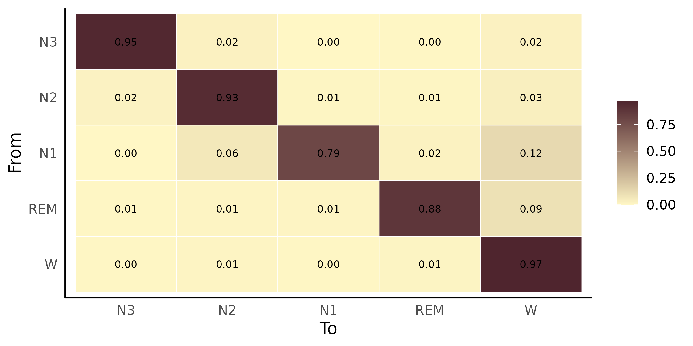
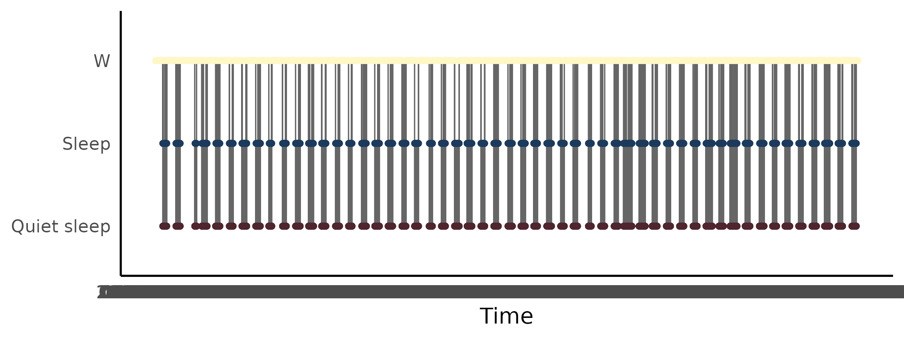
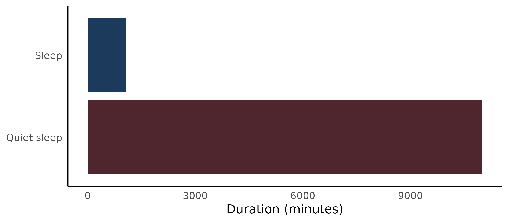

# Getting started with hypnoR

``` r

library(hypnoR)
```

## Overview

**hypnoR** is the hypnogram layer of the Circadia Lab R ecosystem. It
takes a staged hypnogram from anywhere – **mrpheus** (full AASM: `W` /
`N1` / `N2` / `N3` / `REM`), **zeitR** (coarse actigraphy-derived: `W` /
`Sleep` / `Quiet sleep`), or a hand-built tibble – and turns it into
sleep architecture metrics, NREM/REM cycles, transition statistics, and
publication-ready plots.

Every metric and plotting function is **staging-agnostic**: it computes
whatever is possible given the resolution actually present, and returns
`NA` (documented per-function) for metrics that need finer staging than
what’s available.

This article walks through the whole pipeline using a real recording:
mrpheus’s bundled `SC4001E0` example – a 22-hour Sleep-EDF cassette
recording, already staged by mrpheus’s automatic sleep-staging model.

## Installation

``` r

# install.packages("remotes")
remotes::install_github("circadia-bio/hypnoR")
```

## From mrpheus to hypnoR

``` r

staging <- readRDS(system.file("extdata", "SC4001E0_staging.rds", package = "mrpheus"))
staging |> 
  head()
#> # A tibble: 6 × 7
#>   epoch stage prob_N1 prob_N2 prob_N3 prob_REM prob_W
#>   <int> <chr>   <dbl>   <dbl>   <dbl>    <dbl>  <dbl>
#> 1     1 W     0.111   0.00803 0.00192  0.0335   0.846
#> 2     2 W     0.00878 0.0121  0.00364  0.00233  0.973
#> 3     3 W     0.00261 0.00409 0.00178  0.00269  0.989
#> 4     4 W     0.0621  0.0575  0.00901  0.0220   0.849
#> 5     5 W     0.102   0.143   0.0260   0.0845   0.644
#> 6     6 W     0.00921 0.0110  0.0137   0.00935  0.957
```

`staging` is mrpheus’s raw per-epoch output: one row per 30-second
epoch, an AASM `stage` label, and five posterior probabilities from the
underlying LightGBM classifier.
[`mrpheus::export_hypnogram()`](https://mrpheus.circadia-lab.uk/reference/export_hypnogram.html)
prepares it for hypnoR:

``` r

mrp_hyp <- mrpheus::export_hypnogram(
  staging,
  epoch_s        = 30,
  start_time     = as.POSIXct("2024-01-01 16:13:00", tz = "UTC"),
  participant_id = "SC4001"
)
#> ✔ Hypnogram ready: 2650 epochs. Pass to `hypnor::new_hypnogram()` once hypnor is available.
```

(The real recording start time comes from the EDF header at
[`mrpheus::read_edf()`](https://mrpheus.circadia-lab.uk/reference/read_edf.html)
time; the bundled `.rds` doesn’t carry it, so we use a placeholder here
based on the note in mrpheus’s own `sleep-staging-demo` article that the
cassette started around 16:13 local time.)

[`new_hypnogram()`](https://hypnor.circadia-lab.uk/reference/new_hypnogram.md)
– the constructor every other hypnoR function goes through – accepts
this directly:

``` r

hyp <- new_hypnogram(mrp_hyp)
hyp
#> 
#> ── hypnoR hypnogram ────────────────────────────────────────────────────────────
#> ℹ Epochs: 2650
#> ℹ Epoch length: 30 s
#> ℹ Resolution: aasm
#> ℹ Subject: SC4001
#> # A tibble: 2,650 × 5
#>    epoch time                stage subject_id source 
#>  * <int> <dttm>              <ord> <chr>      <chr>  
#>  1     1 2024-01-01 16:13:00 W     SC4001     mrpheus
#>  2     2 2024-01-01 16:13:30 W     SC4001     mrpheus
#>  3     3 2024-01-01 16:14:00 W     SC4001     mrpheus
#>  4     4 2024-01-01 16:14:30 W     SC4001     mrpheus
#>  5     5 2024-01-01 16:15:00 W     SC4001     mrpheus
#>  6     6 2024-01-01 16:15:30 W     SC4001     mrpheus
#>  7     7 2024-01-01 16:16:00 W     SC4001     mrpheus
#>  8     8 2024-01-01 16:16:30 W     SC4001     mrpheus
#>  9     9 2024-01-01 16:17:00 W     SC4001     mrpheus
#> 10    10 2024-01-01 16:17:30 W     SC4001     mrpheus
#> # ℹ 2,640 more rows
```

Staging resolution (`aasm` here, since `N1` / `N2` / `N3` / `REM` are
present) and epoch duration are auto-detected and stored as attributes
on `hyp` – every other hypnoR function reads them from there rather than
asking you to repeat yourself.

## Preprocessing

Two optional cleanup steps happen before any metric sees the hypnogram.

### Smoothing

Automatic per-epoch staging with no temporal continuity constraint – as
here – can produce brief, isolated stage flips that don’t reflect real
sleep physiology (a single REM epoch nested inside an N2 run, for
instance).
[`smooth_hypnogram()`](https://hypnor.circadia-lab.uk/reference/smooth_hypnogram.md)
offers two label-only rules:

``` r

hyp_smooth <- smooth_hypnogram(hyp, method = c("aasm_isolated", "min_run"), min_run_epochs = 4)
mean(hyp_smooth$stage != hyp_smooth$stage_raw)
#> [1] 0.1283019
```

`aasm_isolated` reassigns a single epoch flanked identically on both
sides; `min_run` merges any run shorter than `min_run_epochs` into
whichever flanking run is longer, regardless of whether the flanks
agree. The original, unsmoothed labels are always preserved in
`stage_raw` for comparison.

### Windowing

`SC4001` is a 22-hour ambulatory recording – most of it is ordinary
daytime Wake before and after the one real sleep period. Running metrics
over the *entire* recording would badly distort things like sleep onset
latency and NREM/REM cycle counts, so
[`window_hypnogram()`](https://hypnor.circadia-lab.uk/reference/window_hypnogram.md)
restricts a hypnogram to a time or epoch window before any metric sees
it:

``` r

sleep_idx    <- which(as.character(hyp_smooth$stage) != "W")
onset_epoch  <- hyp_smooth$epoch[sleep_idx[1]]
offset_epoch <- hyp_smooth$epoch[sleep_idx[length(sleep_idx)]]

hyp_sleep <- window_hypnogram(hyp_smooth, from_epoch = onset_epoch, to_epoch = offset_epoch)
nrow(hyp_sleep)
#> [1] 1858
```

[`compute_sleep_architecture()`](https://hypnor.circadia-lab.uk/reference/compute_sleep_architecture.md)
also accepts `lights_off`/`lights_on` directly and windows internally,
if you’d rather pass real lights-off/on timestamps than derive a window
from the data itself.

## Sleep architecture

``` r

arch <- compute_sleep_architecture(hyp_sleep)
arch
#> # A tibble: 1 × 14
#>   tst_min tib_min se_pct sol_min waso_min rem_lat_min sws_lat_min pct_n1 pct_n2
#>     <dbl>   <dbl>  <dbl>   <dbl>    <dbl>       <dbl>       <dbl>  <dbl>  <dbl>
#> 1    372.     929   40.0       0     558.           0         361   6.46   41.2
#> # ℹ 5 more variables: pct_n3 <dbl>, pct_rem <dbl>, pct_sleep <dbl>,
#> #   pct_quiet_sleep <dbl>, staging_resolution <chr>
```

## Stage transitions

``` r

trans <- compute_transitions(hyp_sleep)
trans$matrix
#> # A tibble: 5 × 6
#>   from       N3     N2      N1     REM      W
#>   <chr>   <dbl>  <dbl>   <dbl>   <dbl>  <dbl>
#> 1 N3    0.949   0.0233 0       0.00465 0.0233
#> 2 N2    0.0196  0.928  0.00980 0.00980 0.0327
#> 3 N1    0       0.0625 0.792   0.0208  0.125 
#> 4 REM   0.00578 0.0116 0.0116  0.879   0.0925
#> 5 W     0.00359 0.0108 0.00448 0.0143  0.967
trans$fragmentation
#> # A tibble: 1 × 3
#>   n_transitions fragmentation_index wake_transitions
#>           <int>               <dbl>            <int>
#> 1           101              0.0544               37
```

## NREM/REM cycles

``` r

cyc <- compute_cycles(hyp_sleep, method = "aasm")
cyc
#> # A tibble: 10 × 6
#>    cycle start_epoch end_epoch nrem_min rem_min cycle_min
#>    <int>       <int>     <int>    <dbl>   <dbl>     <dbl>
#>  1     1         319       439     57       3.5      60.5
#>  2     2         440       527     37.5     6.5      44  
#>  3     3         528       574     19.5     4        23.5
#>  4     4         575       767     79.5    17        96.5
#>  5     5         768       844     24      14.5      38.5
#>  6     6         845       983     62.5     7        69.5
#>  7     7         984      1223    112.      8.5     120  
#>  8     8        1224      1378     70.5     7        77.5
#>  9     9        1379      1778    195       5       200  
#> 10    10        1779      2090    152.      4.5     156
```

## Plotting

Two hypnogram styles are available. `"step"` (the default) is the
classic clinical trace:

``` r

plot_hypnogram(hyp_sleep, cycles = cyc)
```



`"capsule"` draws rounded-pill bars per contiguous stage run, one lane
per stage:

``` r

plot_hypnogram(hyp_sleep, style = "capsule")
```



``` r

plot_architecture(arch)
```



``` r

plot_transition_matrix(trans$matrix)
```



## Coarse hypnograms from zeitR

Everything above works identically on coarse, actigraphy-derived staging
– that’s the whole point of “staging-agnostic.” **zeitR** ships a
bundled ActTrust validation recording; running its full rest-activity
pipeline and exporting produces a coarse (`W` / `Sleep` / `Quiet sleep`)
hypnogram:

``` r

result <- zeitR::run_pipeline(
  system.file("extdata", "input1.txt", package = "zeitR"),
  tz    = "UTC",
  quiet = TRUE
)

zeitr_hyp <- zeitR::export_hypnogram(result)
hyp_coarse <- new_hypnogram(zeitr_hyp)
hyp_coarse
#> # A tibble: 76,196 × 5
#>    epoch time                stage subject_id source
#>  * <int> <dttm>              <ord> <chr>      <chr> 
#>  1     1 2021-05-27 11:10:15 W     input1     zeitR 
#>  2     2 2021-05-27 11:11:15 W     input1     zeitR 
#>  3     3 2021-05-27 11:12:15 W     input1     zeitR 
#>  4     4 2021-05-27 11:13:15 W     input1     zeitR 
#>  5     5 2021-05-27 11:14:15 W     input1     zeitR 
#>  6     6 2021-05-27 11:15:15 W     input1     zeitR 
#>  7     7 2021-05-27 11:16:15 W     input1     zeitR 
#>  8     8 2021-05-27 11:17:15 W     input1     zeitR 
#>  9     9 2021-05-27 11:18:15 W     input1     zeitR 
#> 10    10 2021-05-27 11:19:15 W     input1     zeitR 
#> # ℹ 76,186 more rows
```

Resolution is auto-detected as `coarse` (no `N1`/`N2`/`N3`/`REM` labels
present), and every metric function adapts automatically – no separate
“coarse mode” argument anywhere:

``` r

arch_coarse <- compute_sleep_architecture(hyp_coarse)
arch_coarse
#> # A tibble: 1 × 14
#>   tst_min tib_min se_pct sol_min waso_min rem_lat_min sws_lat_min pct_n1 pct_n2
#>     <dbl>   <dbl>  <dbl>   <dbl>    <dbl>       <dbl>       <dbl>  <dbl>  <dbl>
#> 1  12078.   38098   31.7     376    25554          NA          NA     NA     NA
#> # ℹ 5 more variables: pct_n3 <dbl>, pct_rem <dbl>, pct_sleep <dbl>,
#> #   pct_quiet_sleep <dbl>, staging_resolution <chr>
```

Notice `rem_lat_min`, `sws_lat_min`, and the AASM stage percentages
(`pct_n1`/`pct_n2`/`pct_n3`/`pct_rem`) are all `NA` – they need finer
staging than three states can provide – while
`pct_sleep`/`pct_quiet_sleep` are populated instead.
[`compute_transitions()`](https://hypnor.circadia-lab.uk/reference/compute_transitions.md)
works exactly the same way, just over a 3x3 matrix instead of 5x5:

``` r

trans_coarse <- compute_transitions(hyp_coarse)
trans_coarse$matrix
#> # A tibble: 3 × 4
#>   from        `Quiet sleep`   Sleep       W
#>   <chr>               <dbl>   <dbl>   <dbl>
#> 1 Quiet sleep       0.926   0.0655  0.00814
#> 2 Sleep             0.630   0.219   0.151  
#> 3 W                 0.00500 0.00469 0.990
```

[`compute_cycles()`](https://hypnor.circadia-lab.uk/reference/compute_cycles.md)
is the one function that’s genuinely AASM-only – NREM/REM cycle
segmentation needs a REM stage to segment on, so it errors clearly
rather than silently returning nonsense:

``` r

compute_cycles(hyp_coarse)
#> Error in `compute_cycles()`:
#> ! `compute_cycles()` requires a full AASM hypnogram.
#> ✖ `hypnogram` has "coarse" resolution (no REM stage), so NREM/REM cycles cannot
#>   be detected.
```

Plotting works identically too, with a 3-lane layout instead of 5:

``` r

plot_hypnogram(hyp_coarse)
```



``` r

plot_architecture(arch_coarse)
```



## What isn’t here yet

[`read_hypnogram()`](https://hypnor.circadia-lab.uk/reference/read_hypnogram.md)
– ingesting hypnograms directly from CSV, EDF annotations, YASA,
Compumedics, or Nox export files – is still under development. For now,
hypnograms come from an upstream package
([`mrpheus::export_hypnogram()`](https://mrpheus.circadia-lab.uk/reference/export_hypnogram.html),
[`zeitR::export_hypnogram()`](https://zeitr.circadia-lab.uk/reference/export_hypnogram.html))
or a hand-built tibble passed to
[`new_hypnogram()`](https://hypnor.circadia-lab.uk/reference/new_hypnogram.md),
as shown above.

See `vignette("mrpheus-integration", package = "hypnoR")` and
`vignette("zeitR-integration", package = "hypnoR")` (or the “Worked
examples” section of the pkgdown site) for deeper, warts-and-all walks
through cleaning up and interpreting real staging output from each
source.
