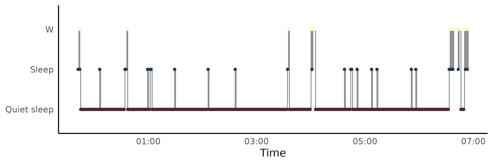
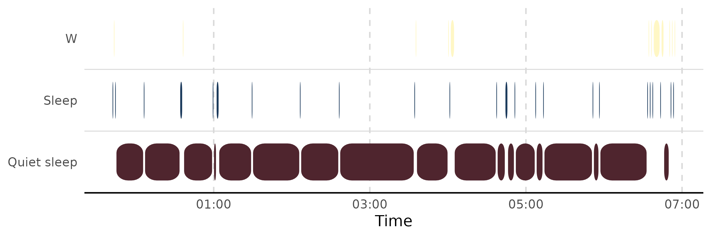
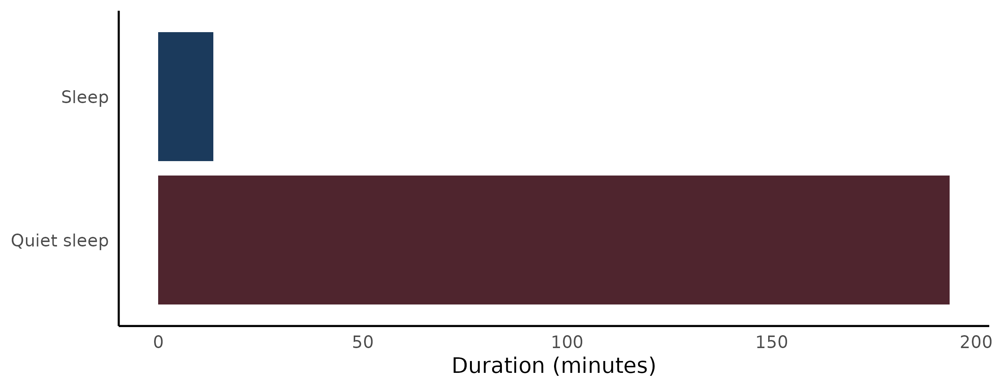

# Coarse hypnograms from actigraphy: a worked example with zeitR

``` r

library(hypnoR)
```

The
[`mrpheus-integration`](https://hypnor.circadia-lab.uk/articles/mrpheus-integration.md)
article walks through hypnoR’s AASM path end-to-end using mrpheus’s raw
automatic PSG staging. Actigraphy-derived staging comes with a different
set of things worth checking before you trust the metrics – this picks
up that same “check before you interpret” habit, using zeitR’s bundled
ActTrust recording instead.

## Getting the data in

zeitR ships a real validation recording, `input1.txt`, used in its own
pipeline-parity tests against a Python reference implementation:

``` r

result <- zeitR::run_pipeline(
  system.file("extdata", "input1.txt", package = "zeitR"),
  tz    = "UTC",
  quiet = TRUE
)
result
```

The `quiet = TRUE` above is deliberate, not just noise-suppression –
worth checking what it’s actually quieting rather than reflexively
silencing it:

``` r

result$issues
#> # A tibble: 5 × 4
#>     row datetime            issue detail                      
#>   <int> <dttm>              <chr> <chr>                       
#> 1 10146 2021-06-03 12:50:54 gap   2199 s gap before this epoch
#> 2 20141 2021-06-10 11:43:44 gap   1130 s gap before this epoch
#> 3 30237 2021-06-17 12:01:57 gap   193 s gap before this epoch 
#> 4 49255 2021-06-30 17:19:12 gap   1215 s gap before this epoch
#> 5 60894 2021-07-08 19:54:25 gap   2233 s gap before this epoch
```

A handful of minor timestamp gaps, no backward jumps, no year artefacts.
Small gaps like this are common in real wearable recordings (a missed
transmission, a brief disconnect) and don’t necessarily invalidate the
recording – but it’s worth actually looking at `$issues` rather than
assuming `quiet = TRUE` means “nothing to see here.”

## Into hypnoR

``` r

zeitr_hyp  <- zeitR::export_hypnogram(result)
hyp        <- new_hypnogram(zeitr_hyp)
attr(hyp, "resolution")
#> [1] "coarse"
nrow(hyp)
#> [1] 76196
```

Coarse resolution, auto-detected correctly (no `N1`/`N2`/`N3`/`REM`
labels in the data). `nrow(hyp)` is likely well beyond one night’s worth
of epochs – `input1.txt` is a multi-day recording, which matters for
everything that follows.

## A caveat: off-wrist time is folded into “Wake”

[`zeitR::export_hypnogram()`](https://zeitr.circadia-lab.uk/reference/export_hypnogram.html)’s
stage mapping sends `state == 4` (off-wrist) to `"W"`, the same label as
genuine wakefulness – there’s no fourth “unknown/off-wrist” category in
hypnoR’s 3-state coarse model. That’s a reasonable simplification, not a
bug, but it means a recording with substantial off-wrist time will show
inflated Wake duration that isn’t really about sleep/wake behaviour at
all. Worth checking how much of this recording that actually is:

``` r

offwrist_epochs <- sum(result$data$state == 4L)
offwrist_epochs
#> [1] 5542
offwrist_epochs / nrow(result$data)  # proportion of the whole recording
#> [1] 0.07273348
```

If that proportion is small, it’s a non-issue here. If a given analysis
turned up unexpectedly long Wake/WASO on a specific night, this is the
first place to check before concluding anything about sleep quality –
the device could simply have been off the wrist.

## Picking the right night

`input1.txt` spans several nights (`result$nights`), so running metrics
over the *entire* multi-day recording would be exactly the kind of
mistake covered in the mrpheus article: `TST` would represent multiple
nights’ sleep combined, and `SOL` would be measured from the very start
of the whole file rather than from any single night’s actual bedtime.

``` r

result$nights
#> # A tibble: 55 × 11
#>    night is_nap bed_time            get_up_time           tbt   tst  waso   sol
#>    <int> <lgl>  <dttm>              <dttm>              <int> <dbl> <dbl> <int>
#>  1     1 FALSE  2021-05-27 23:42:15 2021-05-28 06:54:15   432   414    18     0
#>  2     2 FALSE  2021-05-28 23:30:15 2021-05-29 07:16:15   466   440    25     0
#>  3     3 FALSE  2021-05-30 09:28:15 2021-05-30 12:58:15   210   197     0     8
#>  4     4 FALSE  2021-05-30 22:18:15 2021-05-31 07:58:15   580   553    27     0
#>  5     5 FALSE  2021-05-31 23:24:15 2021-06-01 07:14:15   470   456    12     0
#>  6     6 FALSE  2021-06-02 00:10:15 2021-06-02 07:19:15   429   406    23     0
#>  7     7 FALSE  2021-06-02 23:05:15 2021-06-03 07:47:15   522   492    30     0
#>  8     8 FALSE  2021-06-04 00:01:54 2021-06-04 08:29:54   508   469    39     0
#>  9     9 FALSE  2021-06-04 23:36:54 2021-06-05 05:20:54   344   321     4     9
#> 10    10 FALSE  2021-06-06 00:34:54 2021-06-06 07:30:54   416   401    15     0
#> # ℹ 45 more rows
#> # ℹ 3 more variables: soi <int>, nw <int>, eff <dbl>
```

Restrict to one real night using its own `bed_time`/`get_up_time` –
exactly the `lights_off`/`lights_on` window
[`compute_sleep_architecture()`](https://hypnor.circadia-lab.uk/reference/compute_sleep_architecture.md)
and
[`window_hypnogram()`](https://hypnor.circadia-lab.uk/reference/window_hypnogram.md)
expect:

``` r

night1 <- result$nights[!result$nights$is_nap, ][1L, ]
night1
#> # A tibble: 1 × 11
#>   night is_nap bed_time            get_up_time           tbt   tst  waso   sol
#>   <int> <lgl>  <dttm>              <dttm>              <int> <dbl> <dbl> <int>
#> 1     1 FALSE  2021-05-27 23:42:15 2021-05-28 06:54:15   432   414    18     0
#> # ℹ 3 more variables: soi <int>, nw <int>, eff <dbl>

hyp_night1 <- window_hypnogram(hyp, lights_off = night1$bed_time, lights_on = night1$get_up_time)
nrow(hyp_night1)
#> [1] 433
```

## Does smoothing matter here the way it did for mrpheus?

The mrpheus article found smoothing genuinely necessary, because
[`mrpheus::stage_epochs()`](https://mrpheus.circadia-lab.uk/reference/stage_epochs.html)
is a raw per-epoch argmax classifier with no continuity constraint.
zeitR’s pipeline is different: Crespo (2012)’s sleep-period detection
and Cole-Kripke (1992)’s epoch scoring both impose their own temporal
structure on the output, rather than staging each epoch independently.
Worth checking whether
[`smooth_hypnogram()`](https://hypnor.circadia-lab.uk/reference/smooth_hypnogram.md)
actually finds anything to do here, rather than assuming the same lesson
transfers automatically:

``` r

hyp_smooth <- smooth_hypnogram(hyp_night1, method = c("aasm_isolated", "min_run"), min_run_epochs = 4)
mean(hyp_smooth$stage != hyp_smooth$stage_raw)
#> [1] 0.07159353
```

Whatever that number comes out to, compare it against the mrpheus
article’s equivalent check – if it’s much lower here, that’s evidence
the two staging sources genuinely differ in how much raw epoch-level
noise they produce, not just a coincidence of this particular recording.

## Metrics on the properly-windowed night

``` r

arch_night1 <- compute_sleep_architecture(hyp_night1)
arch_night1
#> # A tibble: 1 × 14
#>   tst_min tib_min se_pct sol_min waso_min rem_lat_min sws_lat_min pct_n1 pct_n2
#>     <dbl>   <dbl>  <dbl>   <dbl>    <dbl>       <dbl>       <dbl>  <dbl>  <dbl>
#> 1     207    216.   95.6       0        9          NA          NA     NA     NA
#> # ℹ 5 more variables: pct_n3 <dbl>, pct_rem <dbl>, pct_sleep <dbl>,
#> #   pct_quiet_sleep <dbl>, staging_resolution <chr>
```

``` r

trans_night1 <- compute_transitions(hyp_night1)
trans_night1$matrix
#> # A tibble: 3 × 4
#>   from        `Quiet sleep`  Sleep       W
#>   <chr>               <dbl>  <dbl>   <dbl>
#> 1 Quiet sleep         0.953 0.0413 0.00517
#> 2 Sleep               0.519 0.111  0.370  
#> 3 W                   0.222 0.389  0.389
trans_night1$fragmentation
#> # A tibble: 1 × 3
#>   n_transitions fragmentation_index wake_transitions
#>           <int>               <dbl>            <int>
#> 1            53               0.123               12
```

[`compute_cycles()`](https://hypnor.circadia-lab.uk/reference/compute_cycles.md)
remains AASM-only regardless of staging source – coarse hypnograms have
no REM stage to segment NREM/REM cycles on:

``` r

compute_cycles(hyp_night1)
#> Error in `compute_cycles()`:
#> ! `compute_cycles()` requires a full AASM hypnogram.
#> ✖ `hypnogram` has "coarse" resolution (no REM stage), so NREM/REM cycles cannot
#>   be detected.
```

## Both plotting styles

``` r

plot_hypnogram(hyp_night1)
```



``` r

plot_hypnogram(hyp_night1, style = "capsule")
```



``` r

plot_architecture(arch_night1)
```



## Main sleep vs naps, if there are any

`result$nights$is_nap` distinguishes zeitR’s main sleep periods from
secondary (nap) periods. Worth checking whether this recording has any
naps at all before assuming a single “the sleep period” exists per day:

``` r

table(result$nights$is_nap)
#> 
#> FALSE 
#>    55
```

If there are naps present, comparing their architecture against a main
night (rather than pooling them together) avoids quietly averaging two
physiologically different kinds of sleep opportunity into one number.

## Takeaways

- Actigraphy-derived hypnograms carry different caveats than automatic
  PSG staging does – off-wrist time masquerading as Wake is the
  zeitR-specific one to check, the way scattered low-confidence REM was
  the mrpheus-specific one.
- `quiet = TRUE` (or any warning-suppression argument) is worth checking
  what it’s actually suppressing, not just trusting it silently.
- Windowing to the real analysis period matters regardless of staging
  source – a multi-night actigraphy recording needs the same care a
  multi-hour ambulatory PSG recording does.
- Smoothing’s necessity is a property of the *staging source*, not a
  universal step to always apply – checking whether it changes anything
  is more honest than assuming a lesson from one pipeline transfers
  unchanged to another.
- [`compute_cycles()`](https://hypnor.circadia-lab.uk/reference/compute_cycles.md)’s
  AASM-only requirement is a genuine constraint of what coarse staging
  can support, not an arbitrary limitation – there’s no REM stage in a
  3-state model to segment cycles on.
